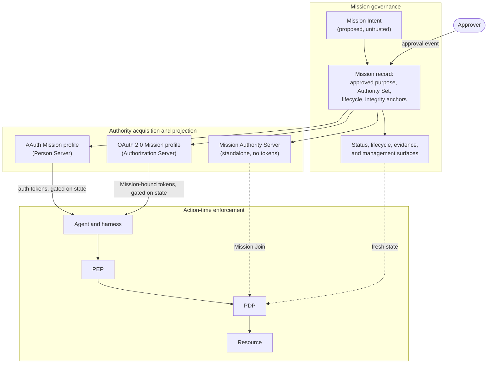

<!-- regenerate: off (edited by hand; set to on to let i-d-template regenerate) -->

# Mission-Bound Authorization

Agents can obtain credentials and invoke tools without having a
durable, portable record of the work a person or policy actually
approved. **Mission-Bound Authorization defines that record.**

The record is the **Mission**: a durable, approval-backed governance
object that binds an approved intent to a concrete **Authority Set**
(the resources, actions, and constraints derived for it), with a
lifecycle independent of any one credential. The Mission is the
common context against which authority is issued, delegated,
enforced, revoked, and audited: an agent's tokens, its sub-agents'
delegations, the per-action permits, the revocation that stops them,
and the evidence an auditor replays all bind back to one approved
record.

The work separates four jobs that are usually conflated:

- **AAuth** provides the native agent-authorization interaction:
  how an agent requests, acquires, presents, and continues
  authority.
- **Mission-Bound Authorization** defines the governance of approved
  work: the record, its integrity anchors, and its lifecycle.
- **OAuth 2.0** provides the deployment profile for existing IAM
  infrastructure. OAuth deployments do not require AAuth.
- **Runtime enforcement** evaluates consequential actions against
  the active Mission at the point of use.

MCP connects an agent to capabilities. This work governs why the
agent may use them.

## The five layers

| Layer | Job |
|---|---|
| **MCP** | Connects agents to capabilities: the tools and resources an agent can call |
| **AAuth** | Carries agent authorization interactions: request, clarify, approve, present, continue |
| **Mission** | Governs the approved undertaking: the durable record, its authority, its lifecycle |
| **OAuth 2.0** | Connects the model to the existing IAM estate: token issuance from the deployed Authorization Server |
| **Runtime** | Enforces the undertaking at action time: a PEP/PDP permit before each consequential action |

Each layer answers a different question, and no layer answers
another's.

## The architecture

One Mission record is minted under an approver; sibling paths
acquire and project authority from it; and consequential actions are
enforced against the active Mission at the point of use.



## The standards kernel

Five documents are the kernel; everything else is an optional
companion profile. No file is renamed in this phase, so each kernel
role names the document that holds it today, with the planned role
stated honestly.

| Kernel role | Document today | What it is |
|---|---|---|
| **Architecture** | `draft-mcguinness-mission-architecture` | The citable structural view: the object, the invariants, components, deployment patterns, assurance levels, and the requirements the family answers. Informational. |
| **Mission Governance Model** | `draft-mcguinness-mission-substrate` (today titled Mission Substrate Requirements) | The binding-neutral semantics: the record, the anchors, the lifecycle and only-`active` rule, the subset rule, approval fidelity, and what any binding provides. Its promotion to the model's definitional home is planned, not yet performed. |
| **Mission Profile for AAuth** | `draft-mcguinness-mission-aauth` (today: the AAuth binding) | The native agent-authorization mapping: AAuth's own mission concept given the model's structure, lifecycle, and anchors. Its maturity depends on the external AAuth draft it profiles. |
| **OAuth 2.0 Profile** | `draft-mcguinness-oauth-mission` (today: the core issuance profile) | The installed-base deployment profile: PAR intake, authority derivation, the `mission` claim, state-gated issuance. Implementation-ready on ratified rails. |
| **Mission-Bound Runtime Enforcement** | `draft-mcguinness-mission-runtime`, with `draft-mcguinness-mission-authzen` beside it | The transport-neutral per-action decision contract; the AuthZEN profile is its concrete decision-API binding. |

Today the model-level definitions are stated normatively by
`draft-mcguinness-oauth-mission` and consolidated binding-neutrally
by `draft-mcguinness-mission-substrate`; the Governance Model
promotion is a later phase (see
[ADR 0001](docs/adr/0001-aauth-mission-oauth-layering.md)), and
ownership migrates by touch, not by relocation.

**Start with the
[Architecture](https://mcguinness.github.io/mission-bound-authorization/#go.draft-mcguinness-mission-architecture.html),
then the kernel profile for your path.** Everything else is optional
companion work, and the minimal implementations below each fit on
one screen. For the story told in prose rather than protocol, the
**[Mission Handbook](https://notes.karlmcguinness.com/mission-handbook/)**
is the published narrative companion: it motivates the model,
chapter by chapter, for readers who want the why before the wire.

## The governance model on one screen

- **The object.** A Mission is created by an explicit approval
  event: a client proposes a **Mission Intent** (untrusted by
  construction), the Mission Issuer derives an **Authority Set** for
  it, and the approval commits both and records the Mission, with
  its Subject and its single accountable Approver, immutable except
  for state.
- **The anchors.** `intent_hash` over the approved Intent and
  `authority_hash` over the consented Authority Set, each computed
  over a domain-separated, issuer-bound envelope with fixed
  canonicalization, so an auditor can reproduce either digest from
  the record alone.
- **Only `active`.** Only the exact state `active` permits issuance
  or continued reliance; every other state, including one a consumer
  does not recognize, is non-active and fails safe. This one rule
  keeps the state space extensible without a registry.
- **The subset rule.** Derived tokens, delegated child Missions,
  attenuated tokens, and cross-domain projections carry subsets;
  authority only narrows as it flows down, and widening exists only
  as a fresh approval that creates a successor Mission.
- **Approval fidelity.** Whatever a binding's native ceremony, it
  authenticates the Approver, establishes the Subject, renders the
  derived authority for consent, computes the anchors over what was
  consented, and creates the record `active` atomically with the
  decision.

A Mission is not a credential, and Mission approval does not itself
authorize a resource action: it creates the governed context that
credentials and per-action permits are derived under and gated on.

## Three deployment paths

The model deploys through three sibling paths (plus an experimental
UMA 2.0 sketch). The path is chosen by the estate, not by
preference, and the record, anchors, and lifecycle carry unchanged
between paths.

- **Native AAuth.** The AAuth Person Server is the Mission Issuer:
  the propose/clarify/approve interaction is the (natively
  asynchronous) approval event, the mission blob carries the record
  with the integrity anchors computed as a projection of AAuth's own
  `s256` commitment, and because the Person Server issues or gates
  every AAuth auth token, issuance gating holds. This path's
  maturity depends on the external AAuth draft it profiles.
- **OAuth installed base.** The Authorization Server is the Mission
  Issuer: the Mission Intent arrives by Pushed Authorization
  Request, every derived token carries the `mission` claim, and
  issuance and refresh are gated on Mission state, so revoking or
  expiring the Mission stops all further authority at once. Runs
  entirely on ratified rails (PAR, RAR, JWT access tokens) and does
  not require AAuth.
- **Standalone Mission Authority Server.** A peer architecture, not
  a workaround: governance deliberately decoupled from token
  issuance, and one Mission Issuer governing across many
  Authorization Servers. The MAS holds the same record without
  issuing tokens; enforcement joins ordinary tokens to the Mission
  at the Policy Decision Point; and the issuance grant
  (`draft-mcguinness-oauth-mission-issuance-grant`) restores
  Mission-bound, state-gated tokens per consuming AS. Operationally
  the same shape also serves estates whose AS cannot change.

Runtime enforcement is transport-neutral: it consumes Mission
semantics identically from all three paths, credential-carried under
AAuth and OAuth, and join-established under the standalone MAS.

## Assurance levels

Four levels name what to deploy, in the order deployments build it;
they are guidance, not a conformance class:

| Level | What it adds |
|---|---|
| **Baseline Issuance** | The approved, anchored record and its lifecycle; where the path issues credentials, state-gated issuance and a possession-independent kill switch (outstanding tokens run to expiry; lifetime-bounded reliance makes that bound a number) |
| **Runtime-Enforced** | A PEP/PDP decision on every consequential action, parameter binding, and prompt revocation; the smallest deployment that turns governed issuance into action-time defense |
| **Governed Agent** (recommended for AI agents) | Consent-rendering evidence and session-continuity stop (consent-evidence and the harness) |
| **High-Assurance Agent** | Resistance to a compromised agent: mediated custody, no unmediated path, action-bound approval, active freshness, agent-isolated approval rendering |

The level is one axis; what a deployment can prove is the orthogonal
axis of named **assurance claims** (approved-record integrity,
bounded revocation latency, action-time enforcement, parameter-bound
enforcement, transaction-grade execution, and the two High-Assurance
claims). Assurance depends on the deployed profiles, not on the
model: a deployment publishes its actual properties (level, path,
state sources and staleness bounds, PEP coverage, custody, evidence,
residual risks) in its **Mission Deployment Profile**, and two
deployments that both "support Mission" but publish different
profiles provide different security properties. The Architecture
document defines the levels, the claims axis, and the Deployment
Profile citably.

## Minimal implementations by path

The first useful piece is one profile, not the suite.

**OAuth path** (the OAuth profile's Conformance section names this
surface):

- `mission_intent` submission through Pushed Authorization Requests;
- derivation of the Authority Set, in narrowing mode via
  `proposed_authority`;
- the Mission record with its `intent_hash` and `authority_hash`
  integrity anchors;
- the `mission` claim on issued tokens and the `authorization_details`
  echo in token responses;
- issuance and refresh gated on Mission state, with revocation by
  `mission_id`; and
- optionally, token introspection reporting Mission state.

**AAuth path** (the AAuth profile's Conformance section):

- the Mission record carried by the mission blob's native and
  profiled members, with the integrity anchors computed as a
  projection of AAuth's `s256` commitment;
- the approval event run as propose/clarify/approve, creating the
  record `active` atomically with the decision;
- the lifecycle with authenticated revocation and expiry, and the
  only-`active` gate atomic with issuance;
- auth tokens issued as Mission-bound credentials, `exp` bounded by
  the Mission's `expires_at`; and
- Mission state served, the record retained for the audit horizon,
  and the deployment's verification mode declared.

**Standalone MAS path** (records mode):

- intent submission, the approval event, and the Mission record with
  its anchors and lifecycle, with no token issuance and no
  Authorization Server change;
- a signed state surface as the freshness source; and
- where enforcement is deployed, the Mission Join: the PDP joins
  ordinary tokens to the Mission at decision time.

What the OAuth minimum alone does **not** protect, by design:
already-issued tokens run to expiry (prompt cutoff needs
introspection, Status, or the runtime layer); completed actions are
not undone; off-path execution by a compromised agent is the runtime
and harness profiles' territory; prompt injection is constrained
(inert intent text, fixed authority), not prevented; and
information-flow leakage within approved authority is out of scope.
The MAS records mode makes no prevention claim of any kind until the
enforcement phases arrive. Choose the assurance level that matches
the risk.

## Companion profiles

Every companion is optional and layers on without changing the
kernel. Grouped by what they do (full descriptions and links in the
document catalog below):

**Approval and lifecycle:**

- **shaping**: client-side shaping of a user's request into a
  candidate Mission Intent, as untrusted proposal (Informational).
- **consent-evidence**: commits what the Approver was shown, through
  `consent_rendering_hash` and a signed Consent Evidence object.
- **approval**: makes the approval event asynchronous (deferred
  approval) on the OAuth path.
- **approval-revision** (experimental): in-review narrowing revision
  of a deferred proposal.
- **status**: the signed state surface and lifecycle endpoint, with
  `suspended` and `completed` and per-entry discharge.
- **signals**: a signed event per lifecycle transition, push or
  poll; the push complement to Status.
- **expansion**: widening through an approved successor Mission.
- **progressive** (experimental): policy-adjudicated expansion
  within a pre-consented authority ceiling.

**Enterprise control plane:**

- **authority-server**: the standalone Mission Issuer and estate
  control plane; the PDP join of ordinary credentials to Missions.
- **issuance-grant**: MAS-minted grants an estate Authorization
  Server redeems for Mission-bound, state-gated tokens.
- **management**: fleet enumeration and bulk lifecycle operations
  for operators and incident response; dry-run first.

**Agent runtime:**

- **harness**: binds sessions, queues, and sub-agent handles to
  Mission state; session continuity is not authority.
- **child-delegation**: Child Missions with lineage, strict-subset
  authority, and cascade revocation.
- **orchestration** (experimental): reversibility classes, unwind
  plans, and compensation after a stop.
- **metering** (experimental): cumulative consumption bounds and the
  metering that enforces them.
- **attenuation** (experimental): narrower Mission-bound tokens
  minted offline; the kill switch preserved by runtime re-check.
- **discovery** (experimental): open-world encounters adjudicated
  against a pre-consented ceiling, with the lying-resource and
  tainted-session floors.

**Cross-domain and evidence:**

- **cross-domain**: single-hop projection of a Mission into another
  trust domain via the cross-domain grant.
- **mandate**: a signed, portable statement of a Mission's committed
  facts; evidence, not a credential.
- **audit**: SCITT transparency for all Mission evidence; receipts
  verifiable offline.
- **security-model**: the trusted base in one view; what each
  component's compromise costs (Informational).

**Experimental bindings:**

- **uma**: the UMA 2.0 binding sketch, the first authored against
  the substrate contract rather than extracted into it.

## Adoption sequence

Crawl, walk, run. The entry step is per path; the later steps are
shared.

1. **Crawl.** Read the **architecture**. Stand up the governance
   record on the path the estate allows: the OAuth minimum where the
   Authorization Server can change, MAS records mode where it cannot
   (records and approvals, no enforcement change), or the AAuth
   Person Server conformance where the substrate is AAuth. The
   architecture's entry-ramp table maps estate starting conditions
   to the right ramp. This is Baseline Issuance.
2. **Walk.** For agents that act: **status**, **runtime**,
   **authzen** (the Runtime-Enforced level). Recommended for AI
   agents: **consent-evidence** and **harness** (the Governed Agent
   level).
3. **Run.** By estate and use case: **authority-server** (the
   estate control plane), **issuance-grant** (the issuance join),
   **substrate** (for binding authors; the planned Governance
   Model), **approval**, **expansion**, **child-delegation**,
   **cross-domain**, **management**, **mandate**, **audit**,
   **shaping**, **signals**. Experimental, adopt for evaluation
   only: **approval-revision**, **progressive**, **metering**,
   **attenuation**, **orchestration**, **discovery**, **uma**.

### Dependency stability

Every normative dependency is a ratified RFC, a finalized OpenID
specification, or (for the **uma** sketch) a final Kantara Initiative
Recommendation, with these tracked exceptions: the OAuth profile
confines its one Internet-Draft reference (the OAuth Actor Profile)
to its OPTIONAL Delegation capability; **cross-domain** depends on
OAuth identity chaining (approved, in the RFC Editor queue) and
ID-JAG (a working-group document); **audit**'s COSE hash envelope is
approved and in the RFC Editor queue; **approval**, **attenuation**,
and **aauth** track unratified individual drafts (OAuth Deferred
Token Response, Attenuating Agent Tokens, and the AAuth protocol
itself, on which the AAuth profile's maturity depends);
**authority-server** confines its Internet-Draft references (client
instance assertion and the AI agent instance profile) to the
Enterprise Mission Authority Profile's instance-bound joins, an
optional hardening above the base conformance floor. For
**authzen**, the stable surface is its core AuthZEN decision
binding; its Access Request and Approval Profile (ARAP) and Model
Context Protocol tool-authorization (COAZ) integrations are
informative and optional.

In short: crawl and walk are built entirely on ratified
dependencies; everything experimental is additive and can wait.

## The standardization ask

Adopt the Mission governance model as the common semantics for
durable, approved agent work. Standardize its AAuth profile as the
native agent-authorization mapping and its OAuth profile as the
installed-base deployment path. Continue runtime, lifecycle,
evidence, enterprise-control-plane, and cross-domain capabilities as
independently adoptable companion profiles.

## The documents

Together these drafts form the **Mission-Bound Authorization
suite**. The suite takes its name from the model; the OAuth
profile's title, "Mission-Bound Authorization for OAuth 2.0", names
the binding that document defines, and the companions refer to it as
the **"issuance profile"** (it governs issuance and derivation).

The naming encodes a boundary. Profiles that extend the
Authorization Server's own surfaces (issuance, approval, lifecycle,
evidence of consent) keep "oauth" in their draft names. Profiles
that specify components outside the Authorization Server (runtime
enforcement and its AuthZEN binding, the agent harness,
orchestration, intent shaping, audit transparency, the security
model, the architecture, the standalone authority server, the AAuth
profile, the substrate requirements, consumption metering,
open-world discovery, and the mandate) are named without it: they
are defined against the Mission model's substrate primitives, each
names those primitives in a Mission Substrate section, and another
mission-based protocol that supplies the same primitives can host
them unchanged.

### The standards kernel

#### An Architecture for Mission-Bound Authorization

The single structural view: the delegated-authority-layer thesis, the
capability envelope, a Mission's life end to end, the seven
invariants, roles and components, the substrate interface (the
primitives a binding provides and the profiles consume), the verb
spine, deployment patterns, the Mission Assurance Levels, the
Deployment Profile, and the requirements the family answers.
Informational; it defines no mechanism, and the profiles remain
authoritative. Read this first.

[Editor's Copy](https://mcguinness.github.io/mission-bound-authorization/#go.draft-mcguinness-mission-architecture.html) · [Datatracker](https://datatracker.ietf.org/doc/draft-mcguinness-mission-architecture) · [Individual Draft](https://datatracker.ietf.org/doc/html/draft-mcguinness-mission-architecture) · [Diff](https://mcguinness.github.io/mission-bound-authorization/#go.draft-mcguinness-mission-architecture.diff)

#### Mission Substrate Requirements

The planned **Mission Governance Model**, today the binding contract
for authors of new bindings. Consolidates, normatively, what any
further binding of the Mission model must provide (identifier and
issuer, the lifecycle state space with the only-`active` rule, the
Authority Set with the subset rule, the integrity anchors, key
material, the audit horizon, approval-event fidelity, and either a
Mission-bound credential or a defined join). Changes nothing for the
three existing bindings, which remain authoritative for themselves;
its promotion to the model's definitional home is planned, and until
that phase lands the model-level definitions remain stated by the
issuance profile.

[Editor's Copy](https://mcguinness.github.io/mission-bound-authorization/#go.draft-mcguinness-mission-substrate.html) · [Datatracker](https://datatracker.ietf.org/doc/draft-mcguinness-mission-substrate) · [Individual Draft](https://datatracker.ietf.org/doc/html/draft-mcguinness-mission-substrate) · [Diff](https://mcguinness.github.io/mission-bound-authorization/#go.draft-mcguinness-mission-substrate.diff)

#### Mission-Bound Authorization for AAuth

The Mission profile for AAuth: the native agent-authorization
mapping. AAuth already carries a mission reference on every signed
request; this profile gives that native concept the Mission model's
structure: the AAuth Person Server is the Mission Issuer, the
mission blob carries the Mission record natively (profiled blob
members, with the integrity anchors computed as a projection of
AAuth's own `s256` commitment), the propose/clarify/approve
interaction is the (natively asynchronous) approval event, and the
family lifecycle rides AAuth's two wire states (`active`,
`terminated`) with revocation and expiry made normative and the
only-`active` rule governing. Because the Person Server issues or
gates every AAuth auth token, this profile provides true issuance
gating in both modes. In its PS-asserted mode it is full provision:
the auth token is a Mission-bound credential, so runtime enforcement
composes credential-carried. Its federated mode is full provision
only where the Access Server carries the family `mission` members,
and Reference-only otherwise. Its maturity depends on the external
AAuth draft it profiles.

[Editor's Copy](https://mcguinness.github.io/mission-bound-authorization/#go.draft-mcguinness-mission-aauth.html) · [Datatracker](https://datatracker.ietf.org/doc/draft-mcguinness-mission-aauth) · [Individual Draft](https://datatracker.ietf.org/doc/html/draft-mcguinness-mission-aauth) · [Diff](https://mcguinness.github.io/mission-bound-authorization/#go.draft-mcguinness-mission-aauth.diff)

#### Mission-Bound Authorization for OAuth 2.0

The **issuance profile**: the OAuth 2.0 deployment profile of the
Mission governance model, and today the kernel document where the
model-level definitions are stated normatively (their consolidation
into the Governance Model is a later phase). Defines the Mission,
the Mission Intent and Authority Set, the approval event and its
`intent_hash` / `authority_hash` integrity anchors, the `mission`
token claim, the subset rule, and state-gated issuance.
Independently deployable and implementation-ready.

[Editor's Copy](https://mcguinness.github.io/mission-bound-authorization/#go.draft-mcguinness-oauth-mission.html) · [Datatracker](https://datatracker.ietf.org/doc/draft-mcguinness-oauth-mission) · [Individual Draft](https://datatracker.ietf.org/doc/html/draft-mcguinness-oauth-mission) · [Diff](https://mcguinness.github.io/mission-bound-authorization/#go.draft-mcguinness-oauth-mission.diff)

#### Mission-Bound Runtime Enforcement

A decision contract for enforcing a Mission-bound token at the point
of use: within a declared enforcement scope, before each
consequential action a Policy Enforcement Point obtains a permit
from a Policy Decision Point that evaluates the action against the
Mission. Covers action classification, where the enforcement point
sits, the binding of a permit to concrete request parameters to
close the time-of-check to time-of-use gap, the fail-closed posture
for consumption bounds, and fail-closed behavior generally. For the
high-consequence classes it adds credential custody and mediated
execution (the enforcement point, not the agent, holds the token's
sender-constraint key, so a compromised agent cannot act off-path)
and an action-bound approval for the highest-consequence classes.
The decision-API wire format is a deployment choice, so the contract
does not mandate one; it is transport-neutral and consumes Mission
semantics identically from every path. Its two named claims,
agent-compromise-resistant enforcement and trifecta containment, set
the High-Assurance Agent bar, and the Mission Receipt makes a single
action's evidence portable.

[Editor's Copy](https://mcguinness.github.io/mission-bound-authorization/#go.draft-mcguinness-mission-runtime.html) · [Datatracker](https://datatracker.ietf.org/doc/draft-mcguinness-mission-runtime) · [Individual Draft](https://datatracker.ietf.org/doc/html/draft-mcguinness-mission-runtime) · [Diff](https://mcguinness.github.io/mission-bound-authorization/#go.draft-mcguinness-mission-runtime.diff)

#### Mission-Bound Runtime Enforcement: AuthZEN Profile

The concrete OpenID AuthZEN binding of the runtime decision contract,
beside it in the kernel. It maps the runtime profile's abstract
decision inputs onto the AuthZEN Authorization API request and
response, defines the Decision Evidence, Execution Evidence, and
Refusal Record objects, and maps every runtime failure condition
onto a wire-visible identifier. It binds the contract; it does not
restate the enforcement semantics the runtime profile owns.

[Editor's Copy](https://mcguinness.github.io/mission-bound-authorization/#go.draft-mcguinness-mission-authzen.html) · [Datatracker](https://datatracker.ietf.org/doc/draft-mcguinness-mission-authzen) · [Individual Draft](https://datatracker.ietf.org/doc/html/draft-mcguinness-mission-authzen) · [Diff](https://mcguinness.github.io/mission-bound-authorization/#go.draft-mcguinness-mission-authzen.diff)

### Approval and lifecycle

#### Mission Intent Shaping

How a client-side "shaper" turns a user's request into a candidate
Mission Intent before it is submitted. The shaper only proposes: its
output is untrusted input until the Mission Issuer validates, narrows,
and derives authority from it. OPTIONAL Shaping Evidence records how
the proposal was produced. (Informational.)

[Editor's Copy](https://mcguinness.github.io/mission-bound-authorization/#go.draft-mcguinness-mission-shaping.html) · [Datatracker](https://datatracker.ietf.org/doc/draft-mcguinness-mission-shaping) · [Individual Draft](https://datatracker.ietf.org/doc/html/draft-mcguinness-mission-shaping) · [Diff](https://mcguinness.github.io/mission-bound-authorization/#go.draft-mcguinness-mission-shaping.diff)

#### Mission Consent Evidence for OAuth 2.0

Commits the structured consent disclosure shown to the Approver at the
approval event, through a `consent_rendering_hash` and a signed Consent
Evidence object, so an auditor can reconstruct the recorded approval
surface. A translation floor requires the disclosure to render
authority as natural language rather than serialized structure, and
Disclosure Interrogation lets the Approver ask why an entry is needed
before deciding, answered from recorded shaping and provenance
material. It commits what the Authorization Server recorded, not the
pixels presented or the Approver's comprehension.

[Editor's Copy](https://mcguinness.github.io/mission-bound-authorization/#go.draft-mcguinness-oauth-mission-consent-evidence.html) · [Datatracker](https://datatracker.ietf.org/doc/draft-mcguinness-oauth-mission-consent-evidence) · [Individual Draft](https://datatracker.ietf.org/doc/html/draft-mcguinness-oauth-mission-consent-evidence) · [Diff](https://mcguinness.github.io/mission-bound-authorization/#go.draft-mcguinness-oauth-mission-consent-evidence.diff)

#### Mission Deferred Approval for OAuth 2.0

Makes the approval event asynchronous. Profiles OAuth
Deferred Token Response so a Mission approval can be deferred and
polled; the Mission record is created atomically with the asynchronous
decision. A proposal the reviewer will grant only in narrowed form
resolves to a denial, and the client resubmits a narrower Intent. An
OAuth-path option: the standalone MAS and the AAuth Person Server
are natively asynchronous and do not use it.

[Editor's Copy](https://mcguinness.github.io/mission-bound-authorization/#go.draft-mcguinness-oauth-mission-approval.html) · [Datatracker](https://datatracker.ietf.org/doc/draft-mcguinness-oauth-mission-approval) · [Individual Draft](https://datatracker.ietf.org/doc/html/draft-mcguinness-oauth-mission-approval) · [Diff](https://mcguinness.github.io/mission-bound-authorization/#go.draft-mcguinness-oauth-mission-approval.diff)

#### Mission Approval Revision for OAuth 2.0

Experimental companion to Deferred Approval. Adds a `revisable` mode:
when the Authorization Server can grant only a narrowed version of the
proposed Mission, it signals which dimensions it refused and invites
the client to push a narrowing revision, continuing the same deferred
approval instead of starting over. Narrowing only; deny-and-resubmit
under Deferred Approval alone is the stable path.

[Editor's Copy](https://mcguinness.github.io/mission-bound-authorization/#go.draft-mcguinness-oauth-mission-approval-revision.html) · [Datatracker](https://datatracker.ietf.org/doc/draft-mcguinness-oauth-mission-approval-revision) · [Individual Draft](https://datatracker.ietf.org/doc/html/draft-mcguinness-oauth-mission-approval-revision) · [Diff](https://mcguinness.github.io/mission-bound-authorization/#go.draft-mcguinness-oauth-mission-approval-revision.diff)

#### Mission Status and Lifecycle for OAuth 2.0

A `mission_id`-keyed status surface with signed responses, plus a
lifecycle endpoint for explicit `revoke`, `suspend`, `resume`, and
`complete` transitions and the `suspended` and `completed` states. It
lets a consumer holding only a `mission_id` ask the issuer for current
Mission state, and an authorized party change it. It also defines
Mission Completion, the narrowing counterpart of Expansion:
`terminal_when`, a Common Constraint that discharges a
`mission_resource_access` entry when its completion condition fires,
monotonic (only retires authority) and so safe against an injected
agent.

[Editor's Copy](https://mcguinness.github.io/mission-bound-authorization/#go.draft-mcguinness-oauth-mission-status.html) · [Datatracker](https://datatracker.ietf.org/doc/draft-mcguinness-oauth-mission-status) · [Individual Draft](https://datatracker.ietf.org/doc/html/draft-mcguinness-oauth-mission-status) · [Diff](https://mcguinness.github.io/mission-bound-authorization/#go.draft-mcguinness-oauth-mission-status.diff)

#### Mission Lifecycle Signals for OAuth 2.0

A profile of the OpenID Shared Signals Framework: the
Mission Issuer
emits a signed Security Event Token on each Mission lifecycle
transition, delivered by push or poll, so a consumer learns of a
revocation, expiry, or other transition promptly without polling. It is
the push complement to the pull-based Status surface, a latency
optimization for deployments where per-Mission polling does not scale.

[Editor's Copy](https://mcguinness.github.io/mission-bound-authorization/#go.draft-mcguinness-oauth-mission-signals.html) · [Datatracker](https://datatracker.ietf.org/doc/draft-mcguinness-oauth-mission-signals) · [Individual Draft](https://datatracker.ietf.org/doc/html/draft-mcguinness-oauth-mission-signals) · [Diff](https://mcguinness.github.io/mission-bound-authorization/#go.draft-mcguinness-oauth-mission-signals.diff)

#### Mission Expansion for OAuth 2.0

How to widen a Mission's authority. Because authority can only narrow
within a Mission, widening requires a fresh approval that creates a
successor Mission, which supersedes its predecessor. Expansion is a
governance operation and is deliberately distinct from authentication
step-up.

[Editor's Copy](https://mcguinness.github.io/mission-bound-authorization/#go.draft-mcguinness-oauth-mission-expansion.html) · [Datatracker](https://datatracker.ietf.org/doc/draft-mcguinness-oauth-mission-expansion) · [Individual Draft](https://datatracker.ietf.org/doc/html/draft-mcguinness-oauth-mission-expansion) · [Diff](https://mcguinness.github.io/mission-bound-authorization/#go.draft-mcguinness-oauth-mission-expansion.diff)

#### Mission Progressive Authorization for OAuth 2.0

Experimental companion to Expansion. At the initial approval the
Approver additionally consents to an authority ceiling and a drawdown
policy; the Mission Issuer may then adjudicate an expansion that stays
within the ceiling by policy instead of a fresh human approval.
High-consequence and cross-domain authority always require the human.
Under Expansion alone, every widening is human-approved.

[Editor's Copy](https://mcguinness.github.io/mission-bound-authorization/#go.draft-mcguinness-oauth-mission-progressive.html) · [Datatracker](https://datatracker.ietf.org/doc/draft-mcguinness-oauth-mission-progressive) · [Individual Draft](https://datatracker.ietf.org/doc/html/draft-mcguinness-oauth-mission-progressive) · [Diff](https://mcguinness.github.io/mission-bound-authorization/#go.draft-mcguinness-oauth-mission-progressive.diff)

### Enterprise control plane

#### Mission Authority Server

A peer deployment architecture, the AS-optional mode, and the estate
control plane of the delegated-authority layer. A Mission Authority
Server implements the Mission Issuer role (intent submission, the
approval event, the record, lifecycle, and state) without being an
OAuth Authorization Server and without deriving tokens. Enforcement
joins ordinary OAuth tokens to Missions at the Policy Decision Point,
so a deployment gets Mission governance with an unmodified AS. No
Mission-bound tokens and no issuance gating; runtime enforcement over
every consequential path is required. Above the conformance floor,
the Enterprise Mission Authority Profile is the estate operating
mode: Join Assertions, instance-bound joins, a mapping contract,
policy-view distribution, and documented PEP coverage, with a
deployment topology, connector patterns, and a progressive adoption
path. Where an AS later becomes Mission-aware, the issuance profile
adds Mission-bound tokens for its resources while the MAS continues
to govern the estate.

[Editor's Copy](https://mcguinness.github.io/mission-bound-authorization/#go.draft-mcguinness-mission-authority-server.html) · [Datatracker](https://datatracker.ietf.org/doc/draft-mcguinness-mission-authority-server) · [Individual Draft](https://datatracker.ietf.org/doc/html/draft-mcguinness-mission-authority-server) · [Diff](https://mcguinness.github.io/mission-bound-authorization/#go.draft-mcguinness-mission-authority-server.diff)

#### Mission Issuance Grant for OAuth 2.0

The issuance join: the middle integration between the standalone
path and a natively Mission-aware AS. A short-lived, one-time,
audience-bound assertion minted by the Mission Authority Server for
an active Mission; an estate Authorization Server redeems it at its
token endpoint (RFC 7523 JWT authorization grant) and mints
Mission-bound tokens bounded by the grant's authority subset, capped
at Mission expiry, with refresh gated on Mission state. Restores
Mission-bound credentials and the issuance-gate kill switch without
the AS implementing the issuance profile's intake, approval, or
derivation surfaces.

[Editor's Copy](https://mcguinness.github.io/mission-bound-authorization/#go.draft-mcguinness-oauth-mission-issuance-grant.html) · [Datatracker](https://datatracker.ietf.org/doc/draft-mcguinness-oauth-mission-issuance-grant) · [Individual Draft](https://datatracker.ietf.org/doc/html/draft-mcguinness-oauth-mission-issuance-grant) · [Diff](https://mcguinness.github.io/mission-bound-authorization/#go.draft-mcguinness-oauth-mission-issuance-grant.diff)

#### Mission Management for OAuth 2.0

The fleet-management surface the status profile defers: authenticated
Mission enumeration (by subject, client, state, or expiry window, with
purpose-recorded audit) and bulk lifecycle operations (dry-run first,
then execute against the evaluated set, with a per-Mission outcome
manifest). Operator- and incident-response-facing; each bulk
transition applies the status profile's per-Mission semantics and
emits its per-Mission events. The highest-blast-radius surface in the
family, and documented as such.

[Editor's Copy](https://mcguinness.github.io/mission-bound-authorization/#go.draft-mcguinness-oauth-mission-management.html) · [Datatracker](https://datatracker.ietf.org/doc/draft-mcguinness-oauth-mission-management) · [Individual Draft](https://datatracker.ietf.org/doc/html/draft-mcguinness-oauth-mission-management) · [Diff](https://mcguinness.github.io/mission-bound-authorization/#go.draft-mcguinness-oauth-mission-management.diff)

### Agent runtime

#### Mission-Aware Agent Harnesses

How an agent harness binds sessions, task graphs, queues, cached tool
connections, and sub-agent handles to Mission state, when it must
re-check status, and how it must pause, suppress, or terminate work when
the Mission is no longer active. It also establishes the mediated
execution environment the runtime profile relies on: for mediated action
classes, governed work runs with no unmediated path to the resource. The
core principle: session continuity is not authority.

[Editor's Copy](https://mcguinness.github.io/mission-bound-authorization/#go.draft-mcguinness-mission-harness.html) · [Datatracker](https://datatracker.ietf.org/doc/draft-mcguinness-mission-harness) · [Individual Draft](https://datatracker.ietf.org/doc/html/draft-mcguinness-mission-harness) · [Diff](https://mcguinness.github.io/mission-bound-authorization/#go.draft-mcguinness-mission-harness.diff)

#### Mission Child Delegation for OAuth 2.0

Lets a parent Mission authorize a Child Mission for a sub-agent, with
explicit parent lineage, strict-subset authority, expiry no later than
the parent, fan-out controls, and cascade revocation when the parent
reaches a terminal state (suspension pauses, not terminates). A child
is never created by session ancestry alone.

[Editor's Copy](https://mcguinness.github.io/mission-bound-authorization/#go.draft-mcguinness-oauth-mission-child-delegation.html) · [Datatracker](https://datatracker.ietf.org/doc/draft-mcguinness-oauth-mission-child-delegation) · [Individual Draft](https://datatracker.ietf.org/doc/html/draft-mcguinness-oauth-mission-child-delegation) · [Diff](https://mcguinness.github.io/mission-bound-authorization/#go.draft-mcguinness-oauth-mission-child-delegation.diff)

#### Mission Orchestration and Unwinding

How a multi-step or multi-Mission workflow assigns a reversibility class
to each step, records an unwind plan before dispatch, and unwinds
in-flight work safely when a Mission stops, including compensation after
termination. It governs how workflow state is unwound once continuation
is stopped. (Experimental.)

[Editor's Copy](https://mcguinness.github.io/mission-bound-authorization/#go.draft-mcguinness-mission-orchestration.html) · [Datatracker](https://datatracker.ietf.org/doc/draft-mcguinness-mission-orchestration) · [Individual Draft](https://datatracker.ietf.org/doc/html/draft-mcguinness-mission-orchestration) · [Diff](https://mcguinness.github.io/mission-bound-authorization/#go.draft-mcguinness-mission-orchestration.diff)

#### Mission Consumption Metering

Experimental. Defines the cumulative consumption bounds a Mission
Intent may carry (`max_budget`, `max_calls`, `max_duration`,
`max_egress_volume`), the `exclusive` control that latches
conflicting action classes apart under a single approval, the
runtime metering that enforces them (atomic check-and-decrement,
reserve/commit postures, duration leases, settlement), and the AuthZEN
wire binding for lease renewal and settlement. Without it, Missions
carry no cumulative bounds; the runtime profile's fail-closed rule
covers any bound a deployment cannot meter.

[Editor's Copy](https://mcguinness.github.io/mission-bound-authorization/#go.draft-mcguinness-mission-metering.html) · [Datatracker](https://datatracker.ietf.org/doc/draft-mcguinness-mission-metering) · [Individual Draft](https://datatracker.ietf.org/doc/html/draft-mcguinness-mission-metering) · [Diff](https://mcguinness.github.io/mission-bound-authorization/#go.draft-mcguinness-mission-metering.diff)

#### Mission Offline Attenuation for OAuth 2.0

Removes the Authorization Server from the sub-agent fan-out hot path.
Profiles Attenuating Agent Tokens so a Mission-bound token holder mints a
narrower child token offline, carrying the same `mission` claim; the
narrowing is verifiable from the carried token chain. The kill switch is
preserved because consumption is gated by the runtime layer re-checking
Mission state, so a revoked Mission stops the whole chain. A capability
for deployments running the runtime enforcement profile, offered
alongside Authorization-Server-mediated delegation. (Experimental.)

[Editor's Copy](https://mcguinness.github.io/mission-bound-authorization/#go.draft-mcguinness-oauth-mission-attenuation.html) · [Datatracker](https://datatracker.ietf.org/doc/draft-mcguinness-oauth-mission-attenuation) · [Individual Draft](https://datatracker.ietf.org/doc/html/draft-mcguinness-oauth-mission-attenuation) · [Diff](https://mcguinness.github.io/mission-bound-authorization/#go.draft-mcguinness-oauth-mission-attenuation.diff)

#### Mission Open-World Discovery

Experimental. Makes discovery a governed operation for agents that
meet resources their approval could not name. Defines the Encounter,
resource identity pinning (origin, the RFC 9728 resource-to-AS
metadata chain, self-declaration digests), Discovery Adjudication
against a pre-consented ceiling (bind, route to a human, or refuse;
default-closed), and Discovery Evidence for the transparency log.
Two floors hold regardless of policy: a resource's self-declaration
never classifies its own consequences, and a tainted session never
binds egress-capable authority without a human.

[Editor's Copy](https://mcguinness.github.io/mission-bound-authorization/#go.draft-mcguinness-mission-discovery.html) · [Datatracker](https://datatracker.ietf.org/doc/draft-mcguinness-mission-discovery) · [Individual Draft](https://datatracker.ietf.org/doc/html/draft-mcguinness-mission-discovery) · [Diff](https://mcguinness.github.io/mission-bound-authorization/#go.draft-mcguinness-mission-discovery.diff)

### Cross-domain and evidence

Three layers of proof, from the approval surface outward: Consent
Evidence commits what the Approver was shown (listed under Approval
and lifecycle above); the Mandate makes a Mission's committed facts
portable and independently verifiable; Audit Transparency makes all
Mission evidence tamper-evident in an append-only log.

#### Mission Cross-Domain Projection for OAuth 2.0

Lets a single Mission be honored by Authorization Servers in other
trust domains: the originating Mission Issuer projects audience-scoped
authority through a short-lived, sender-constrained cross-domain grant
(ID-JAG recommended), and the Resource AS mints its own local
Mission-bound tokens from it, preserving the `mission` claim unchanged.
One hop; the single-domain issuance profile is complete without it.
Extracted from the issuance profile so the kernel carries no
cross-domain dependencies.

[Editor's Copy](https://mcguinness.github.io/mission-bound-authorization/#go.draft-mcguinness-oauth-mission-cross-domain.html) · [Datatracker](https://datatracker.ietf.org/doc/draft-mcguinness-oauth-mission-cross-domain) · [Individual Draft](https://datatracker.ietf.org/doc/html/draft-mcguinness-oauth-mission-cross-domain) · [Diff](https://mcguinness.github.io/mission-bound-authorization/#go.draft-mcguinness-oauth-mission-cross-domain.diff)

#### Mission Mandate

A signed, portable, independently verifiable statement of a Mission's
committed facts (its identifiers, integrity anchors, Subject, Approver,
and optionally its Authority Set), minted by the Mission Issuer. It is
evidence, not a credential: presenting it authorizes nothing. It lets a
cross-domain verifier, an external rail deriving its own vertical
mandate, or an auditor know what was approved without a token exchange;
current state still comes from Status or Signals. OPTIONAL selective
disclosure via SD-JWT.

[Editor's Copy](https://mcguinness.github.io/mission-bound-authorization/#go.draft-mcguinness-mission-mandate.html) · [Datatracker](https://datatracker.ietf.org/doc/draft-mcguinness-mission-mandate) · [Individual Draft](https://datatracker.ietf.org/doc/html/draft-mcguinness-mission-mandate) · [Diff](https://mcguinness.github.io/mission-bound-authorization/#go.draft-mcguinness-mission-mandate.diff)

#### Mission Audit Transparency

Makes the suite's evidence tamper-evident and independently verifiable.
Registers Mission evidence (the approval event, lifecycle transitions,
runtime and consent evidence) into a SCITT Transparency Service as
Signed Statements, with the Mission as the statement subject so a
Mission's records form one append-only feed, and binds the Receipt back
so any party, in any domain, can verify inclusion offline. Statements
commit to evidence by hash, so sensitive task data stays out of the log.
Layers onto any level.

[Editor's Copy](https://mcguinness.github.io/mission-bound-authorization/#go.draft-mcguinness-mission-audit.html) · [Datatracker](https://datatracker.ietf.org/doc/draft-mcguinness-mission-audit) · [Individual Draft](https://datatracker.ietf.org/doc/html/draft-mcguinness-mission-audit) · [Diff](https://mcguinness.github.io/mission-bound-authorization/#go.draft-mcguinness-mission-audit.diff)

#### Mission Security Model

A cross-cutting, Informational consolidation of the suite's trusted base.
Enforcement is spread across components (Authorization Server or Mission
Authority Server, PEP, PDP, harness, consent rendering, and optional
state, access-request, transparency, and event-source services); each
profile states its own security considerations, but this document gives
the single view: what each component must achieve, what it assumes of
the others, and how its compromise degrades the guarantees. It defines
no new mechanism and points to the profiles' normative security
considerations.

[Editor's Copy](https://mcguinness.github.io/mission-bound-authorization/#go.draft-mcguinness-mission-security-model.html) · [Datatracker](https://datatracker.ietf.org/doc/draft-mcguinness-mission-security-model) · [Individual Draft](https://datatracker.ietf.org/doc/html/draft-mcguinness-mission-security-model) · [Diff](https://mcguinness.github.io/mission-bound-authorization/#go.draft-mcguinness-mission-security-model.diff)

### Experimental bindings

#### Mission-Bound Authorization for UMA 2.0

Experimental sketch, and the first binding authored against the
substrate contract rather than extracted into it. UMA 2.0
standardized the plumbing of asynchronous, party-asymmetric
authorization (the rotating permission ticket, `request_submitted`,
claims pushing, per-use introspection, and a continuity token that
grants nothing) and deliberately left the authorization assessment
unspecified; this binding fills that interior with the Mission. The
pushed Mission Intent rides claims pushing at the token endpoint,
the resource owner's decision is the approval event, the lifecycle
gates every RPT issuance and upgrade, the RPT is the Mission-bound
credential (token-carried or introspection-carried via the
registered `mission` member), and the PCT is Mission continuity that
is never authority. Full provision on ratified substrate machinery
end to end; the trades are UMA's thin deployed base and its
scope-coarse authority grain, which leaves runtime enforcement's
role unchanged.

[Editor's Copy](https://mcguinness.github.io/mission-bound-authorization/#go.draft-mcguinness-mission-uma.html) · [Datatracker](https://datatracker.ietf.org/doc/draft-mcguinness-mission-uma) · [Individual Draft](https://datatracker.ietf.org/doc/html/draft-mcguinness-mission-uma) · [Diff](https://mcguinness.github.io/mission-bound-authorization/#go.draft-mcguinness-mission-uma.diff)

## Contributing

See the
[guidelines for contributions](https://github.com/mcguinness/mission-bound-authorization/blob/main/CONTRIBUTING.md).

The contributing file also has tips on how to make contributions, if you
don't already know how to do that.

This work is provided under the license in
[LICENSE.md](LICENSE.md).

## Command Line Usage

Formatted text and HTML versions of the draft can be built using `make`.

```sh
$ make
```

Command line usage requires that you have the necessary software installed.  See
[the instructions](https://github.com/martinthomson/i-d-template/blob/main/doc/SETUP.md).

On macOS, building also requires GNU sed on `PATH` (`brew install
gnu-sed`, then prepend `/opt/homebrew/opt/gnu-sed/libexec/gnubin`):
the template's draft-name substitution exceeds BSD sed's per-expression
buffer once a repository carries this many drafts, failing with
`sed: unterminated substitute pattern`. CI uses GNU sed and is
unaffected.
