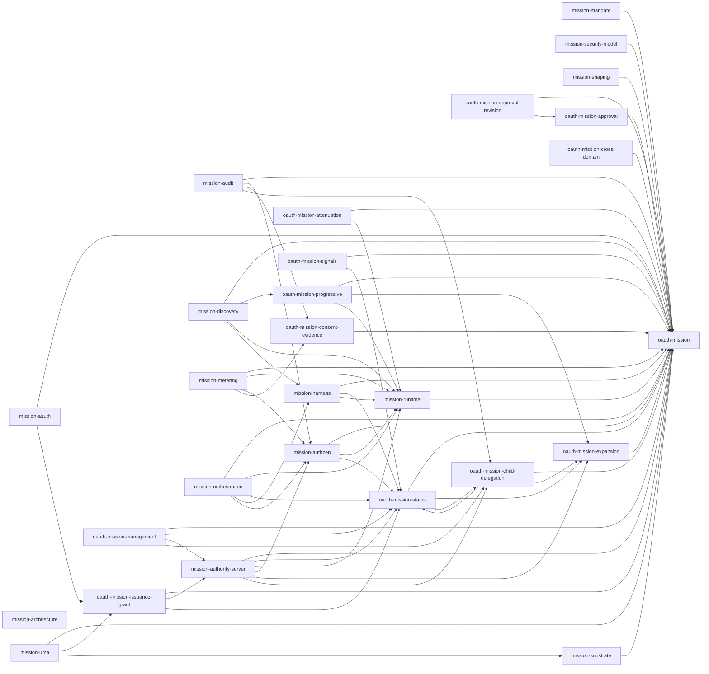

# Current Dependency Graph

Phase 0 baseline record for the repository repositioning. Factual snapshot at branch `repositioning-exploration` (HEAD `dc7a897`); no draft was modified.

## Method and scope

- Edges were parsed from each draft's kramdown-rfc front matter: entries named `I-D.draft-mcguinness-*` under the `normative:` and `informative:` blocks.
- Family scope is the 28 drafts present in this repository. The front matter also references seven of the author's drafts maintained outside this repository; these are excluded from the graph and listed per document under "external":
  draft-mcguinness-oauth-actor-profile, -oauth-client-instance-assertion, -oauth-ai-agent-instance, -oauth-id-assertion-framework, -oauth-domain-authorized-issuer, -oauth-actor-receipts, -oauth-actor-proofs.
- Edge counts (family scope): 65 normative, 260 informative, 325 total, across 28 documents.
- Names below drop the `draft-mcguinness-` prefix for compactness.

## Per-document adjacency (outbound references)

### mission-aauth

- Normative: oauth-mission, oauth-mission-issuance-grant
- Informative: oauth-mission-progressive, mission-discovery, mission-authority-server, oauth-mission-status, oauth-mission-signals, mission-runtime, mission-authzen, oauth-mission-consent-evidence, mission-shaping, mission-architecture, mission-substrate, mission-mandate, mission-security-model, oauth-mission-child-delegation, oauth-mission-attenuation, oauth-mission-cross-domain, mission-audit

### mission-architecture

- Normative: (none)
- Informative: mission-metering, oauth-mission-cross-domain, oauth-mission, oauth-mission-issuance-grant, mission-discovery, mission-authority-server, mission-uma, mission-aauth, mission-substrate, oauth-mission-management, mission-shaping, oauth-mission-consent-evidence, oauth-mission-approval, oauth-mission-status, oauth-mission-signals, oauth-mission-progressive, oauth-mission-expansion, mission-runtime, mission-authzen, mission-harness, mission-orchestration, oauth-mission-child-delegation, oauth-mission-attenuation, mission-mandate, mission-audit, mission-security-model
- External (out of scope): oauth-client-instance-assertion (informative), oauth-ai-agent-instance (informative)

### mission-audit

- Normative: oauth-mission, mission-authzen, oauth-mission-consent-evidence, oauth-mission-child-delegation
- Informative: oauth-mission-signals, mission-runtime, mission-harness, mission-mandate, mission-aauth, mission-discovery, mission-authority-server, mission-architecture

### mission-authority-server

- Normative: oauth-mission, oauth-mission-status, mission-runtime, mission-authzen, oauth-mission-expansion, oauth-mission-child-delegation
- Informative: oauth-mission-issuance-grant, mission-substrate, mission-harness, mission-security-model, oauth-mission-consent-evidence, oauth-mission-signals, oauth-mission-approval, oauth-mission-progressive, oauth-mission-attenuation, mission-audit, mission-mandate, mission-architecture
- External (out of scope): oauth-client-instance-assertion (informative), oauth-ai-agent-instance (informative)

### mission-authzen

- Normative: oauth-mission, mission-runtime, oauth-mission-status
- Informative: oauth-mission-expansion, oauth-mission-progressive, mission-metering, mission-harness
- External (out of scope): oauth-client-instance-assertion (informative), oauth-ai-agent-instance (informative)

### mission-discovery

- Normative: oauth-mission, oauth-mission-progressive, mission-runtime, mission-harness
- Informative: mission-aauth, oauth-mission-approval, oauth-mission-expansion, oauth-mission-cross-domain, mission-authzen, mission-metering, mission-audit, mission-architecture, mission-authority-server
- External (out of scope): oauth-domain-authorized-issuer (informative)

### mission-harness

- Normative: oauth-mission, oauth-mission-status, mission-runtime
- Informative: mission-audit, oauth-mission-signals, oauth-mission-expansion, oauth-mission-child-delegation, mission-discovery, mission-orchestration, mission-authzen
- External (out of scope): oauth-client-instance-assertion (informative), oauth-ai-agent-instance (informative)

### mission-mandate

- Normative: oauth-mission
- Informative: oauth-mission-issuance-grant, oauth-mission-cross-domain, oauth-mission-status, oauth-mission-signals, mission-audit, mission-runtime, mission-aauth, mission-authority-server

### mission-metering

- Normative: oauth-mission, mission-runtime, mission-authzen, oauth-mission-consent-evidence
- Informative: mission-architecture, mission-substrate, mission-orchestration

### mission-orchestration

- Normative: oauth-mission, mission-runtime, oauth-mission-status, mission-harness, mission-authzen
- Informative: mission-architecture, oauth-mission-expansion, oauth-mission-signals

### mission-runtime

- Normative: oauth-mission
- Informative: mission-security-model, mission-audit, mission-shaping, mission-mandate, mission-authzen, mission-harness, mission-metering, oauth-mission-consent-evidence, oauth-mission-status, oauth-mission-signals, oauth-mission-cross-domain, mission-architecture, mission-aauth, oauth-mission-issuance-grant, oauth-mission-attenuation, mission-authority-server
- External (out of scope): oauth-client-instance-assertion (informative), oauth-ai-agent-instance (informative), oauth-actor-receipts (informative), oauth-actor-proofs (informative)

### mission-security-model

- Normative: oauth-mission
- Informative: mission-architecture, oauth-mission-progressive, oauth-mission-cross-domain, mission-runtime, mission-harness, oauth-mission-consent-evidence, oauth-mission-status, mission-audit, mission-mandate, oauth-mission-attenuation, mission-authzen, oauth-mission-approval, oauth-mission-expansion, mission-orchestration, oauth-mission-signals, mission-aauth, oauth-mission-issuance-grant, mission-discovery, mission-authority-server, mission-substrate, mission-shaping, mission-metering, oauth-mission-child-delegation, oauth-mission-approval-revision, oauth-mission-management
- External (out of scope): oauth-id-assertion-framework (informative), oauth-domain-authorized-issuer (informative), oauth-client-instance-assertion (informative), oauth-ai-agent-instance (informative)

### mission-shaping

- Normative: oauth-mission
- Informative: mission-aauth, mission-architecture, mission-authority-server, mission-runtime, oauth-mission-approval, oauth-mission-approval-revision, oauth-mission-child-delegation, oauth-mission-consent-evidence, oauth-mission-progressive

### mission-substrate

- Normative: oauth-mission
- Informative: oauth-mission-issuance-grant, mission-authority-server, mission-aauth, mission-runtime, mission-architecture, oauth-mission-status, mission-mandate, mission-audit, mission-security-model, mission-discovery, oauth-mission-progressive

### mission-uma

- Normative: oauth-mission, oauth-mission-issuance-grant, mission-substrate
- Informative: mission-architecture, mission-authority-server, mission-aauth, oauth-mission-approval, oauth-mission-approval-revision, oauth-mission-status, oauth-mission-signals, mission-runtime, mission-authzen, oauth-mission-consent-evidence, mission-shaping, mission-harness, oauth-mission-progressive, oauth-mission-expansion, mission-metering, mission-mandate, mission-security-model, mission-audit, oauth-mission-child-delegation, oauth-mission-attenuation, oauth-mission-cross-domain

### oauth-mission

- Normative: (none)
- Informative: oauth-mission-status, oauth-mission-signals, oauth-mission-cross-domain, mission-authority-server, mission-architecture, mission-runtime, oauth-mission-expansion, mission-metering, oauth-mission-consent-evidence, oauth-mission-approval, mission-audit
- External (out of scope): oauth-actor-profile (normative), oauth-client-instance-assertion (informative), oauth-ai-agent-instance (informative)

### oauth-mission-approval

- Normative: oauth-mission
- Informative: oauth-mission-approval-revision, mission-shaping, mission-authority-server, oauth-mission-consent-evidence, oauth-mission-expansion

### oauth-mission-approval-revision

- Normative: oauth-mission, oauth-mission-approval
- Informative: mission-shaping, oauth-mission-consent-evidence, oauth-mission-expansion

### oauth-mission-attenuation

- Normative: oauth-mission, mission-runtime
- Informative: oauth-mission-issuance-grant, oauth-mission-child-delegation, oauth-mission-cross-domain, mission-harness

### oauth-mission-child-delegation

- Normative: oauth-mission, oauth-mission-status, oauth-mission-expansion
- Informative: oauth-mission-issuance-grant, oauth-mission-attenuation, oauth-mission-signals, mission-harness, mission-architecture
- External (out of scope): oauth-client-instance-assertion (informative), oauth-ai-agent-instance (informative)

### oauth-mission-consent-evidence

- Normative: oauth-mission
- Informative: mission-audit, mission-shaping, mission-security-model, mission-authority-server, mission-aauth, oauth-mission-status, oauth-mission-expansion, oauth-mission-approval, oauth-mission-approval-revision, mission-runtime

### oauth-mission-cross-domain

- Normative: oauth-mission
- Informative: mission-architecture, mission-mandate, oauth-mission-status, oauth-mission-signals, mission-runtime
- External (out of scope): oauth-id-assertion-framework (informative), oauth-domain-authorized-issuer (informative), oauth-actor-receipts (informative)

### oauth-mission-expansion

- Normative: oauth-mission
- Informative: oauth-mission-status, mission-runtime, oauth-mission-child-delegation, oauth-mission-signals, oauth-mission-progressive

### oauth-mission-issuance-grant

- Normative: oauth-mission, mission-authority-server, oauth-mission-status
- Informative: mission-mandate, oauth-mission-cross-domain, mission-runtime, mission-architecture, mission-substrate

### oauth-mission-management

- Normative: oauth-mission, oauth-mission-status, mission-authority-server, oauth-mission-child-delegation
- Informative: oauth-mission-expansion, oauth-mission-signals, mission-architecture, mission-audit, mission-security-model

### oauth-mission-progressive

- Normative: oauth-mission, oauth-mission-expansion, mission-runtime
- Informative: mission-discovery, mission-aauth, mission-security-model, oauth-mission-child-delegation, oauth-mission-consent-evidence, oauth-mission-status, mission-metering, mission-architecture

### oauth-mission-signals

- Normative: oauth-mission, oauth-mission-status
- Informative: mission-harness, mission-audit, oauth-mission-expansion, oauth-mission-child-delegation, mission-authority-server, mission-aauth, oauth-mission-management

### oauth-mission-status

- Normative: oauth-mission, oauth-mission-expansion, oauth-mission-child-delegation
- Informative: oauth-mission-signals, mission-runtime, oauth-mission-cross-domain, oauth-mission-management, mission-authority-server, mission-aauth, mission-mandate, mission-authzen

## Normative edges (Mermaid)

Arrow direction: referencing document points to the document it normatively references. Informative edges are omitted.

## Findings

### Inbound normative edges (most depended-on documents)

| Document | Inbound normative | Inbound informative |
|---|---|---|
| oauth-mission | 26 | 1 |
| mission-runtime | 8 | 14 |
| oauth-mission-status | 8 | 12 |
| mission-authzen | 4 | 8 |
| oauth-mission-child-delegation | 4 | 10 |
| oauth-mission-expansion | 4 | 13 |
| mission-authority-server | 2 | 15 |
| mission-harness | 2 | 10 |
| oauth-mission-consent-evidence | 2 | 11 |
| oauth-mission-issuance-grant | 2 | 8 |
| mission-substrate | 1 | 6 |
| oauth-mission-approval | 1 | 8 |
| oauth-mission-progressive | 1 | 9 |
| mission-aauth | 0 | 13 |
| mission-architecture | 0 | 17 |
| mission-audit | 0 | 14 |
| mission-discovery | 0 | 7 |
| mission-mandate | 0 | 11 |
| mission-metering | 0 | 8 |
| mission-orchestration | 0 | 4 |
| mission-security-model | 0 | 9 |
| mission-shaping | 0 | 8 |
| mission-uma | 0 | 1 |
| oauth-mission-approval-revision | 0 | 5 |
| oauth-mission-attenuation | 0 | 7 |
| oauth-mission-cross-domain | 0 | 11 |
| oauth-mission-management | 0 | 4 |
| oauth-mission-signals | 0 | 16 |

- The document with the most inbound normative edges is **oauth-mission** (the OAuth core), with 26 of the 27 other documents referencing it normatively. The only document that does not is mission-architecture, whose family references are all informative (it is Informational and defines no mechanism).
- Next by inbound normative edges: **mission-runtime** (8) and **oauth-mission-status** (8), then oauth-mission-child-delegation, oauth-mission-expansion, and mission-authzen (4 each).

### Cycles among normative references

Exactly one normative cycle exists:

| Cycle | Edge 1 | Edge 2 |
|---|---|---|
| oauth-mission-status <-> oauth-mission-child-delegation | status lists child-delegation as normative | child-delegation lists status as normative |

No other normative cycle exists; removing either edge of this pair makes the normative graph acyclic. (Informative references are heavily bidirectional throughout the family and were not analyzed for cycles.)

### The substrate document (mission-substrate)

References out:

- Normative: oauth-mission (its only normative family reference; the substrate document states that each requirement points at the core section that owns it).
- Informative: oauth-mission-issuance-grant, mission-authority-server, mission-aauth, mission-runtime, mission-architecture, oauth-mission-status, mission-mandate, mission-audit, mission-security-model, mission-discovery, oauth-mission-progressive.

Referenced by:

- Normatively: mission-uma (the one binding authored against the substrate contract).
- Informatively: mission-aauth, mission-architecture, mission-authority-server, mission-metering, mission-security-model, oauth-mission-issuance-grant.

The asymmetry is the recorded state: the substrate names most of the family informatively (as consumers of the primitives it consolidates), while only the UMA binding depends on it normatively; the three pre-existing bindings (the core, the Mission Authority Server, the AAuth binding) reference it informatively or not at all and predate it.
